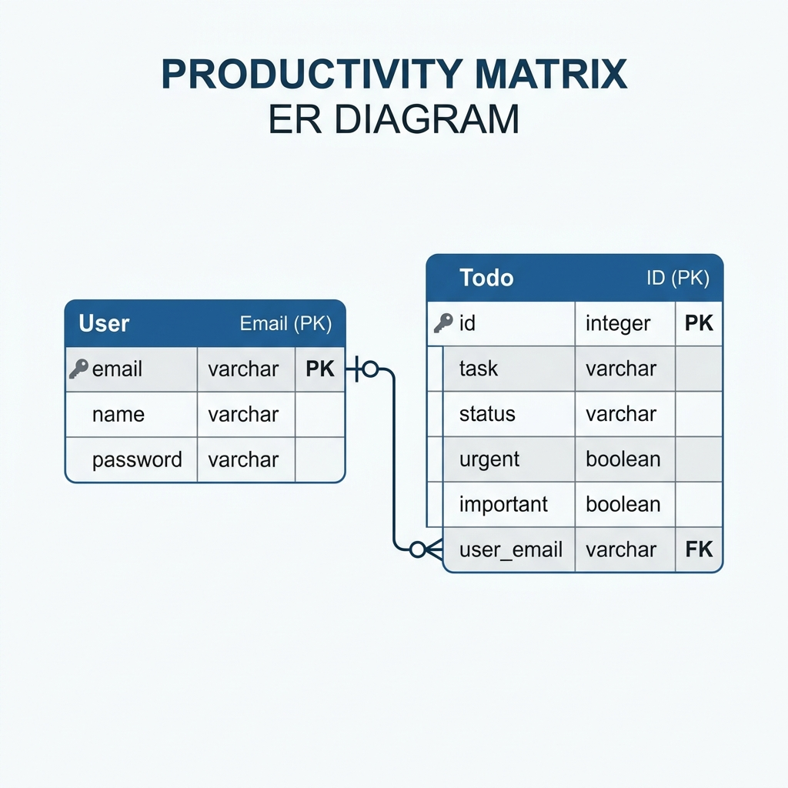

# Software Requirements Document (SRD) - Productivity Manager

## 1. Project Overview
The **Productivity Manager** is a simple, effective tool built to help students take control of their busy lives. We use the **Eisenhower Matrix**—a classic way to sort tasks by how **Urgent** and **Important** they are. Instead of just a long to-do list, Productivity Manager helps students decide what to "Do First," what to "Schedule," what to "Delegate," and what to "Eliminate" entirely. With a clean, modern design, it turns task management into a visual dashboard that actually makes sense.

---

## 2. Functional Requirements
These are the core features that make the app work for you:

| ID | Feature Name | Description |
|---|---|---|
| **FR-01** | User Registration | New users can quickly create an account using their name and email. |
| **FR-02** | User Login | Securely log in to see your personal task matrix. Sessions keep you logged in while you work. |
| **FR-03** | Task Classification | Add any task and check if it’s "Urgent" or "Important." The app sorts it into the right quadrant automatically. |
| **FR-04** | Matrix Dashboard | See all your tasks in a clear 2x2 grid. It gives you instant stats on how much of your life is in each category. |
| **FR-05** | Task Management | Mark tasks as "Done" once finished or delete them if they are no longer needed. |
| **FR-06** | Productivity Reveal | Click a single button to see your productivity score based on how well you're managing your "Schedule" (Quadrant 2) tasks. |

---

## 3. Non-Functional Requirements
These ensure the app feels fast, safe, and reliable:

1.  **Speed (NFR-01)**: The dashboard should load almost instantly (in less than 2 seconds) so you don't waste time.
2.  **Security (NFR-02)**: Passwords must be at least 6 characters long to keep accounts safe. We use secure sessions to protect your data.
3.  **Reliability (NFR-03)**: Your tasks are saved safely in our "Singleton" database, meaning they won't disappear if the server restarts.
4.  **Premium Feel (NFR-04)**: The app uses a "Glassmorphism" look—dark mode with blur effects—to make it feel like a high-end modern tool.
5.  **Easy Updates (NFR-05)**: Built with Maven, making it easy for developers to add new features or fix bugs in the future.

---

## 4. Domain Rules
The "ground rules" that the software follows:

- **Rule 1**: Every task must live in one of the four quadrants. No task is left behind!
- **Rule 2**: You can't use a password shorter than 6 characters—it’s for your own security.
- **Rule 3**: Productivity isn't just about doing "Urgent" things; it's calculated by how many "Important" (but not urgent) tasks you actually finish.
- **Rule 4**: Only you can see your tasks. Privacy is baked into the system.

---

## 5. Entity Relationship Diagram (ERD)
The database structure is designed to be lean and efficient:

### Data Dictionary

#### Table: `User`
- `email` (Primary Key, VARCHAR): The unique identifier for each user.
- `name` (VARCHAR): The full name of the user.
- `password` (VARCHAR): The user's secure account password.

#### Table: `Todo` (Task)
- `id` (Primary Key, VARCHAR): Unique identifier for each task.
- `task` (TEXT): The description of the task.
- `status` (VARCHAR): Current state ('pending' or 'done').
- `urgent` (BOOLEAN): Classification for urgency.
- `important` (BOOLEAN): Classification for importance.
- `user_email` (Foreign Key): Link to the `User` table.

---

## 6. Traceability Matrix
We’ve run **13 JUnit tests** to make sure everything works perfectly.

| Test Name | Type of Test | Requirement Verified | Status |
|---|---|---|---|
| `testValidEmail` | Positive | FR-01 (Registration Validation) | ✅ PASS |
| `testUserRegistration` | Positive | FR-01 (Account Creation) | ✅ PASS |
| `testUserLoginSuccess` | Positive | FR-02 (Secure Login) | ✅ PASS |
| `testUserExists` | Positive | FR-01 (Database Integrity) | ✅ PASS |
| `testGetUserName` | Positive | FR-02 (Session Data) | ✅ PASS |
| `testDuplicateUser` | Negative | FR-01 (Unique Email Check) | ✅ PASS |
| `testLoginWrongPass` | Negative | FR-02 (Incorrect Password Handling) | ✅ PASS |
| `testExpectedException`| Negative | System Stability (Error Handling) | ✅ PASS |
| `testPassBoundary(6)` | Boundary | NFR-02 (Min Password Length) | ✅ PASS |
| `testPassBelowBoundary`| Boundary | NFR-02 (Short Password Rejection) | ✅ PASS |
| `testEmailBoundary` | Boundary | FR-01 (Minimal Email Format) | ✅ PASS |
| `testParamInvalidEmail`| Parameterized | FR-01 (Robust Format Check) | ✅ PASS |
| `testParamValidPass` | Parameterized | NFR-02 (Complex Passwords) | ✅ PASS |
